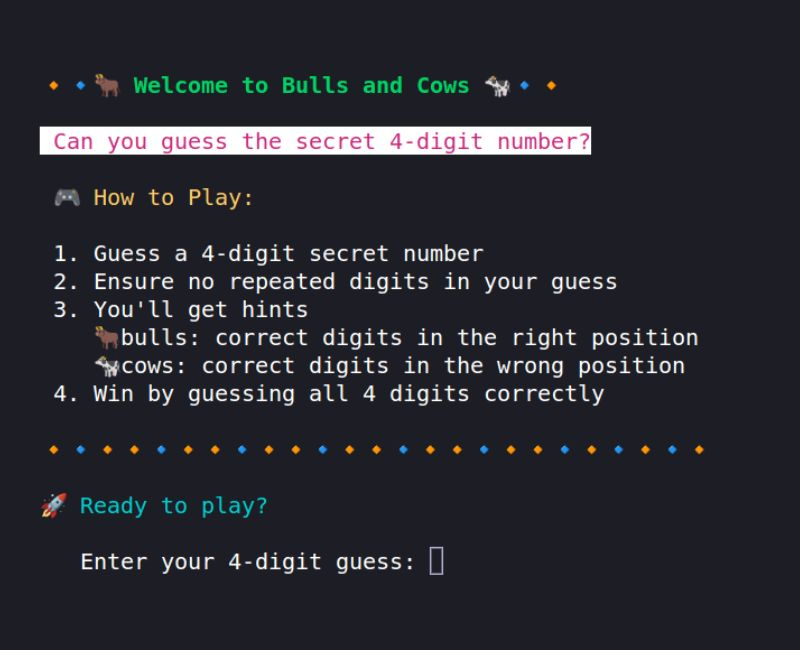
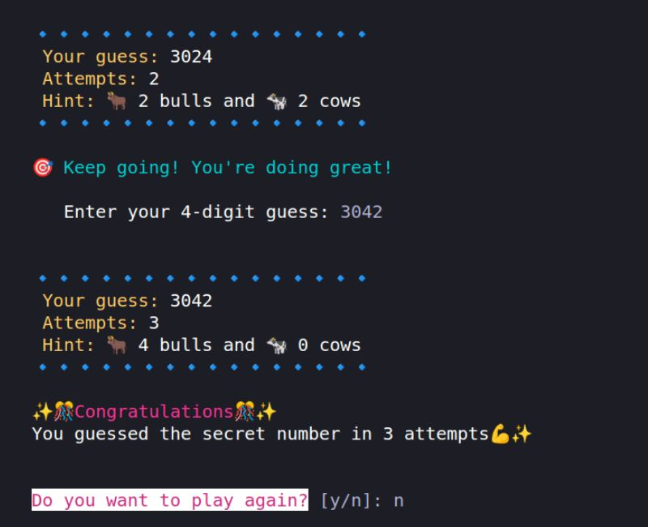

# My JavaScript Final Project 4 🚀✨

## Welcome to my JavaScript/TypeScript project repository 👋

### 🐂 Bulls and Cows 🐄

This project encapsulates the classic Bulls and Cows guessing game in a digital format.  
The game tests your deductive skills and challenges you to guess a secret 4-digit number.  
Inspired by the traditional pen-and-paper game, this digital version brings a console-based experience to life.

### Tools I used
-  JavaScript
-  TypeScript
-  npm
-  Node.js
-  Linux
-  Git
-  GitHub

### TypeScript Significance
TypeScript's use significantly enhanced this project's robustness and maintainability.   
Its static typing capabilities caught potential errors during development, improving code quality and reducing bugs.   
Leveraging TypeScript's features boosted readability and maintainability, making it a vital aspect of the development process.

### Features
✅ Interactive Console Game: Engage in an entertaining guessing game right in your console  
✅ Strategic Guesses: Apply deduction and logic to make precise guesses and crack the secret number  
✅ Feedback and Hints: Receive informative hints to guide you towards the secret number  
✅ Error Handling: Prompt notifications for invalid inputs, repeated digits, or incorrect number format to enhance your gaming experience  
✅ Continual Play: Keep playing until you successfully decode the entire secret number  

### Libraries I used:
- chalk: Adds color and style to the console output for a better visual experience   
- prompt-sync & readline-sync: Facilitates user input in the console   

   

Feel free to personalize and elevate the game💥   
Enjoy the challenge, and may your deductive skills bring you thrilling victories in the world of Bulls and Cows🐂🐄💕